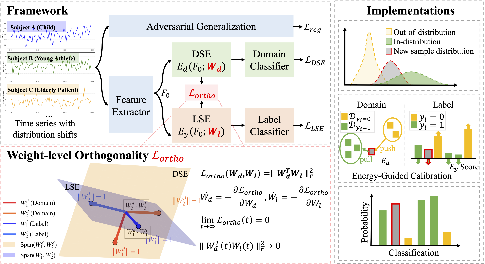
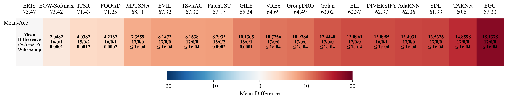

# ERIS: An Energy-Guided Feature Disentanglement Framework for Out-of-Distribution Time Series Classification

[](https://www.python.org/downloads/release/python-380/)
[](https://pytorch.org/)
[](LICENSE)
[](https://arxiv.org/abs/2508.14134)

## Overview

ERIS addresses the critical challenge of out-of-distribution (OOD) generalization in time series classification. Traditional methods suffer from feature entanglement, where domain-specific and label-relevant features become coupled, leading to spurious correlations and poor generalization.

**Key Innovation**: ERIS introduces **energy-guided calibration** to provide semantic guidance for feature disentanglement, moving beyond purely mathematical constraints to achieve meaningful separation of domain-invariant and label-specific representations.

### The Problem
- Models learn spurious shortcuts between domain-specific and label-relevant features
- Current disentanglement methods are **unguided**, lacking semantic direction
- Performance degrades significantly under distribution shifts

### Our Solution
ERIS provides **guided disentanglement** through three key mechanisms:
1. **Energy-Guided Calibration**: Uses physical energy properties to semantically guide feature separation
2. **Weight-Level Orthogonality**: Enforces structural independence between domain and label features
3. **Adversarial Generalization**: Enhances robustness through structured perturbations

## Architecture


### Loss Components

1. **Orthogonality Loss (L_ortho)**: `||W_d^T * W_l||_F^2` → Ensures weight-level independence
2. **Domain Energy Loss (L_DSE)**: Promotes domain-invariant representations  
3. **Label Energy Loss (L_LSE)**: Maintains class discrimination with prototype alignment
4. **Regular Loss (L_reg)**: Standard classification + adversarial regularization

**Total Loss**: `L_total = λ₁L_DSE + λ₂L_LSE + L_ortho + L_reg`

## Supported Datasets

Due to file size limitations, the Opportunity dataset requires separate download:

**Opportunity Dataset Download:**

- Baidu Netdisk: [Download Link](https://pan.baidu.com/s/1aNmf7B5o-GUgUqp0PZ7n3w) (d6bv)
- Google Drive: [Download Link](https://drive.google.com/drive/folders/1WKKYz02uqfvfTkr_yzdlhe6_zsWq5vsJ?usp=drive_link)

After downloading, extract and place the UniMiB-SHAR data in `./data/Opportunity/` directory. Other Datasets: EMG, UCIHAR, and Opportunity datasets are included in the repository under `./data/` directory.

| Dataset | Description | Domains | Classes | Samples | Channels |
|---------|-------------|---------|---------|---------|----------|
| **EMG** | Electromyography gesture recognition | 4 | 6 | 6,883 | 200 |
| **UCIHAR** | UCI Human Activity Recognition | 5 | 6 | 1,609 | 9 |
| **UniMiB-SHAR** | Smartphone-based activity recognition | 4 | 17 | 1,569 | 453 |
| **Opportunity** | Complex daily living activities | 4 | 18 | 869,387 | 77 |

### Domain Identifiers
- **EMG**: ['0', '1', '2', '3'] 
- **UCIHAR**: ['0', '1', '2', '3', '4']
- **UniMiB-SHAR**: ['1', '2', '3', '5']  
- **Opportunity**: ['S1', 'S2', 'S3', 'S4']

## Main Results



**Key Achievements**:
- 🏆 **#1 Average Rank (1.375)** across all baselines
- 📊 **Lowest ECE (0.12)** indicating superior calibration
- ✅ **Statistically Significant** improvements (p < 0.05)

## Installation

### Prerequisites
- Python 3.8+ 
- CUDA-capable GPU (recommended)
- 8GB+ GPU memory for larger datasets

### Quick Start
```bash
# Clone the repository
git clone https://github.com/your-repo/ERIS.git
cd ERIS

# Create conda environment
conda create -n eris python=3.8
conda activate eris

# Install dependencies
pip install torch torchvision torchaudio
pip install numpy pandas scikit-learn matplotlib seaborn tqdm
```

### Dependencies
```bash
pip install torch>=1.9.0
pip install numpy>=1.21.0
pip install pandas>=1.3.0
pip install scikit-learn>=1.0.0
pip install matplotlib>=3.4.0
pip install seaborn>=0.11.0
pip install tqdm>=4.62.0
```

### Directory Structure
```
ERIS/
├── main.py                 # Main training script
├── models.py              # ERIS model implementation  
├── data_load.py           # Data loading utilities
├── run_custom_epochs.sh   # Batch training script
├── data/                  # Dataset directory
│   ├── EMG/
│   ├── UCIHAR/
│   ├── UniMiB-SHAR/
│   └── Opportunity/
├── results/               # Results directory (auto-created)
│   ├── [DATASET]/
│   │   ├── models/           # Model weights (.pth)
│   │   ├── test_results/     # Evaluation results (.json)
│   │   ├── visualizations/   # Feature plots (.png)
│   │   └── *_summary.csv     # Performance summaries
│   └── analysis/            # Cross-dataset analysis
└── logs/                  # Training logs (auto-created)
```

## Usage

### Single Domain Training

**Basic Training**:
```bash
python main.py \
    --dataset UCIHAR \
    --target-domain 0 \
    --epochs 100 \
    --batch-size 64 \
    --lr 1e-4 \
    --gpu 0 \
    --mode train \
    --save-dir ./results/UCIHAR
```

**Advanced Training with Custom Loss Weights**:
```bash
python main.py \
    --dataset EMG \
    --target-domain 1 \
    --epochs 100 \
    --batch-size 64 \
    --lr 1e-4 \
    --orth-weight 1.0 \
    --domain-energy-weight 0.9 \
    --label-energy-weight 2.0 \
    --regular-weight 1.0 \
    --save-dir ./results/EMG \
    --seed 42
```

### Model Evaluation

**Test Single Domain**:
```bash
python main.py \
    --dataset UCIHAR \
    --target-domain 0 \
    --mode test \
    --save-dir ./results/UCIHAR \
    --model-path ./results/UCIHAR/models/best_model.pth
```

**Test Specific Domain**:
```bash
python main.py \
    --dataset UCIHAR \
    --target-domain 0 \
    --mode test \
    --domain 2 \
    --save-dir ./results/UCIHAR
```

### Feature Visualization

Generate t-SNE visualizations of learned features:
```bash
python main.py \
    --dataset UCIHAR \
    --target-domain 0 \
    --mode visualize \
    --save-dir ./results/UCIHAR \
    --model-path ./results/UCIHAR/models/best_model.pth
```

### Batch Training

Run experiments across all domains for all datasets using parallel GPUs:

```bash
# Make script executable
chmod +x run_custom_epochs.sh

# Run with default batch size (64)
./run_custom_epochs.sh

# Run with custom batch size
./run_custom_epochs.sh 128
```

## Troubleshooting

### Common Issues

**CUDA Out of Memory**:
```bash
# Reduce batch size
python main.py --batch-size 32

# Use gradient accumulation
python main.py --grad-accumulation-steps 2
```

**Poor Convergence**:
```bash
# Adjust learning rate
python main.py --lr 5e-5

# Increase epochs for difficult datasets
python main.py --epochs 150
```

## Results Structure

The training process creates an organized directory structure:

```
results/
├── EMG/
│   ├── models/                    # Best model weights (.pth files)
│   ├── test_results/             # Evaluation metrics (.json files)  
│   ├── visualizations/           # Feature plots (.png files)
│   ├── EMG_summary.csv          # Domain-wise results
│   ├── EMG_statistics.csv       # Statistical analysis
│   └── training_history_*.png   # Training curves
├── UCIHAR/ ...                   # Similar structure for each dataset
├── UniMiB-SHAR/ ...
├── Opportunity/ ...  
└── analysis/                     # Cross-dataset analysis
    ├── all_detailed_results.csv
    ├── overall_summary.csv
    ├── comprehensive_analysis.png
    └── comprehensive_report.md
```

## Contributing

We welcome contributions! Please follow these guidelines:

1. **Fork** the repository
2. **Create** a feature branch (`git checkout -b feature/amazing-feature`)
3. **Commit** your changes (`git commit -m 'Add amazing feature'`)
4. **Push** to the branch (`git push origin feature/amazing-feature`)
5. **Open** a Pull Request

## License

This project is licensed under the MIT License - see the [LICENSE](LICENSE) file for details.

##  Contact

- **Xin Wu**: xinwu5386@gmail.com or wu1351658806@163.com
- **Fei Teng** (Corresponding Author): fteng@swjtu.edu.cn

## Citation

If you use ERIS in your research, please cite:

```bibtex
@misc{wu2025erisenergyguidedfeaturedisentanglement,
      title={ERIS: An Energy-Guided Feature Disentanglement Framework for Out-of-Distribution Time Series Classification}, 
      author={Xin Wu and Fei Teng and Ji Zhang and Xingwang Li and Yuxuan Liang},
      year={2025},
      eprint={2508.14134},
      archivePrefix={arXiv},
      url={https://arxiv.org/abs/2508.14134}, 
}
```

## Baseline Methods & Code Links

We compare ERIS against state-of-the-art methods from four categories:

### Time Series OOD Generalization Methods
- **GILE** (AAAI'21): [cross-person-HAR](https://github.com/Hangwei12358/cross-person-HAR)
- **AdaRNN** (CIKM'21): [transferlearning/adarnn](https://github.com/jindongwang/transferlearning/tree/master/code/deep/adarnn)
- **Diversify** (ICLR'23): [robustlearn/diversify](https://github.com/microsoft/robustlearn/tree/main/diversify)
- **ITSR** (KDD'24): [CGCL-codes/ITSR](https://github.com/CGCL-codes/ITSR)

### General OOD Generalization Methods
- **DeepDG Toolkit**: [transferlearning/DeepDG](https://github.com/jindongwang/transferlearning/tree/master/code/DeepDG)
  - Includes GroupDRO, VREx, DANN, MLDG, Mixup, RSC, ANDMask, DIFEX
- **SDL** (AAAI'23): [StochasticDisturbanceLearning](https://github.com/ZlatanWilliams/StochasticDisturbanceLearning)
- **FOOGD** (NeurIPS'24): [FOOGD-main](https://github.com/XeniaLLL/FOOGD-main)
- **EVIL** (IJCV'25): [EVIL](https://github.com/tmllab/EVIL)

### General Time Series Methods
- **TARNet** (KDD'22): [TARNet](https://github.com/ranakroychowdhury/TARNet)
- **PatchTST** (ICLR'23): [PatchTST](https://github.com/yuqinie98/PatchTST)
- **TS-GAC** (AAAI'24): [TS-GAC](https://github.com/Frank-Wang-oss/TS-GAC)
- **MPTSNet** (AAAI'25): [MPTSNet](https://github.com/MUYang99/MPTSNet)

### Energy-Based Methods
- **EOW-Softmax** (ICCV'21): [Energy-based open-world uncertainty modeling](https://github.com/BIGKnight/Energy-Based-Open-World-Uncertainty-Modeling-for-Confidence-Calibration)
- **ELI** (CVPR'22): [Energy-based latent aligner for incremental learning](https://github.com/JosephKJ/ELI)
- **EGC** (ICCV'23): [Energy-guided diffusion-based model](https://github.com/GuoQiushan/EGC)
- **Golan et al.** (NeurIPS'24): [Adversarialy-trained energy-based classification](https://github.com/Shelley-Golan/Boosting-via-Joint-Model)

**⭐ If you find ERIS helpful, please consider giving us a star!**